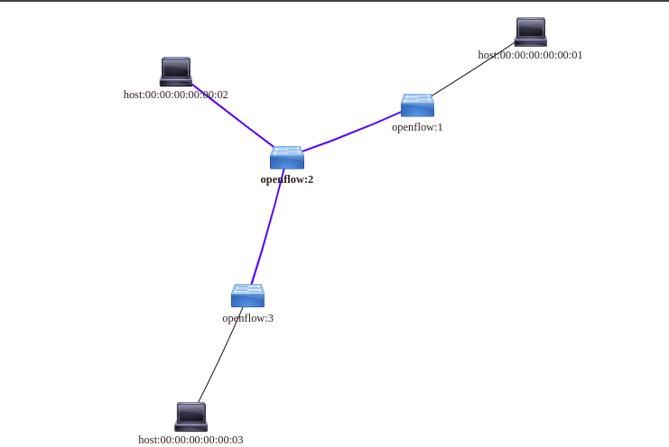

# SDN Algorithms

Software defined network algorithms using opendaylight controller

# Instructions 

Configure ODL controller and mininet. More detailed instructions here:
http://www.brianlinkletter.com/using-the-opendaylight-sdn-controller-with-the-mininet-network-emulator/

# Dependencies
The project was tested on
* Python 2.7
* ODL distribution 0.3.0-Lithium / 0.4.1-BerilliumSR1

# The project 
This project includes the following scripts/libraries:
* Topologies/: This folder contains some example network topologies used in this project
* `GraphAlgorithm.py` This module contains implementations of the following graph algorithms
	* `shortest_path(src,dest)`: The shortest path from one node to another.
	* `all_paths(src,dest)`: All paths of two nodes.
	* `all_pairs_shortest_path()`: A matrix describing the shortest paths between every pair of nodes.
	* Other auxiliary functions, more detailed info  on code comments.
* `Main.py`: Handles the ODL REST requests and uses GraphAlgorithm module.
# Screenshot

